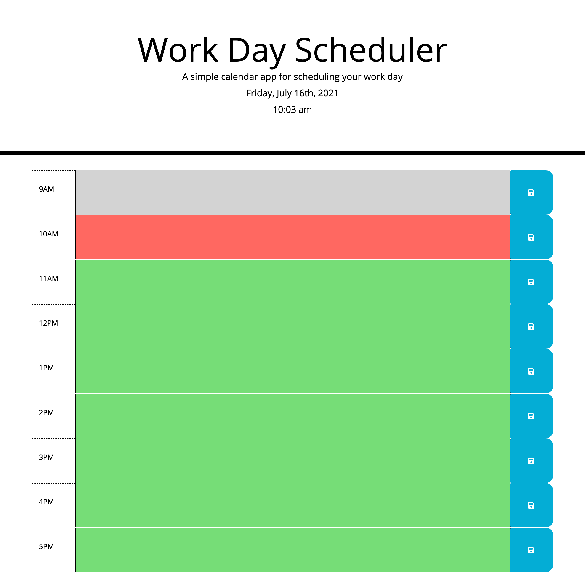

## WorkDay Planner
This repository contains refactored code for Rutgers Coding Bootcamp's fifth challenge homework, Third-Party APIs.
[Click here to see the original code!](https://github.com/coding-boot-camp/super-disco)

For this week, our task was to refactor the given code and add Javascript,JQUERY, and Moment.JS elements so that we will have a functional schedule planner for a work day.

The planner will have a 9 hour timeblock from 09:00AM to 5:00PM. Users will have the ability to click on a timeblock and add tasks that they intend to do for that time. Users can then hit the save button so their tasks are saved and will stay on the page even if they accidentally refresh or exit the page.

The timeblocks are color coded with light grey for previous hours, red for the current hour, and green for future hours(IE if it's within 10 am right now, 9am will show up as light grey,10am will show up as red, then 11am onwards will be green).

## Website
Visit my website here!

https://ronnieve23.github.io/WorkDayPlanner/